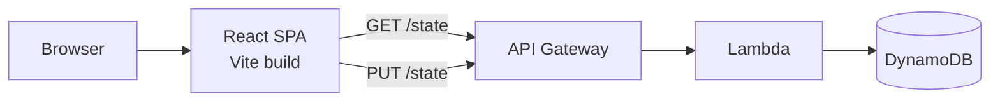

# Purrductivity

A task dashboard that pays you for finishing things.

Every task is a "quest". Completing one awards XP and treats based on its
priority — XP levels up Mochi, the resident cat, and treats buy the
accessories she wears. The gamification is the point: the reward loop is
what gets the list actually cleared.

React 19 + Vite frontend, AWS API Gateway backend, no UI or charting
libraries — every icon, the cat, and all six charts are hand-built.

<!-- Add a screenshot or GIF here: docs/screenshot.png -->

---

## The reward economy

| Priority | XP | Treats |
|---|---|---|
| Low | +5 | +1 |
| Medium | +10 | +2 |
| High | +15 | +3 |

- **50 XP** raises Mochi one level. Levels are permanent.
- **Treats** are spent in her closet. An item needs both the right level
  and enough treats.
- Each quest pays out **once**. Restoring a completed quest from the
  archive and finishing it again does not pay twice — `rewardClaimed`
  guards that.

The in-app "How it works" panel renders these numbers from
`src/lib/constants.js`, the same module the scoring logic reads, so the
documentation cannot drift from the behaviour.

---

## Architecture



The backend is a single `/state` resource that reads and writes one
document, `{ tasks, catProfile }`. There is no per-task REST API and no
auth — it is a single-user app.

**The backend is not in this repository.** It is an API Gateway endpoint
in `us-east-1`; the frontend only needs its base URL.

Writes are debounced by 600ms in `TaskStoreProvider`, so a burst of
changes coalesces into one `PUT` instead of one per state change.

### Frontend layout

```
src/
├── api.js              GET/PUT against /state, or mock data
├── App.jsx             routing and layout only
├── App.css             one stylesheet, tokens at the top
├── lib/
│   ├── constants.js    reward economy, defaults (no asset imports)
│   ├── accessories.js  the closet catalogue (imports SVGs)
│   ├── dates.js        local-time date helpers
│   ├── tasks.js        filtering, sorting, normalisation
│   ├── stats.js        pure analytics for the Insights page
│   └── seed.js         deterministic sample data
├── store/              task state + handlers, via context
├── pages/              one file per route
└── components/
    └── charts/         hand-rolled SVG charts
```

---

## Running it

```bash
git clone <this repo>
cd aws-task-dashboard
npm install
cp .env.example .env     # then fill in VITE_API_URL
npm run dev
```

`npm run build` produces `dist/`; `npm run preview` serves it.

### Running without a backend

```bash
VITE_USE_MOCK=true npm run dev
```

This generates ~120 deterministic historical tasks in memory and skips
the network entirely — useful for working on the Insights charts, which
need months of history to be worth looking at, without spending API
Gateway requests or touching real data.

---

## Design notes

**Why no component library.** The cat is roughly forty nested divs shaped
entirely in CSS, and the icons are drawn with `::before`/`::after` and
`box-shadow`. A component library would have fought that rather than
helped it.

**Tokens, not hexes.** `App.css` began with 61 distinct hex values and no
custom properties, so a colour change meant a find-and-replace. It now
opens with a `:root` block; the conversion was verified by resolving
every `var()` back to its literal and diffing against the original file
byte-for-byte.

**Why no charting library.** Recharts or Chart.js would have imposed its
own visual language on a very specific pink one, for six charts that are
a `<polyline>`, a CSS grid, and some flexbox. They are hand-built instead.

**Chart colours are not the badge colours.** The priority badges
(`low`/`medium`/`high`) are tuned for small pill text. As chart fills the
green and amber are nearly indistinguishable — OKLab ΔE 11.6 for normal
vision, under the 15 floor, and worse under simulated colour-vision
deficiency. The chart palette is re-stepped in the same hue families to
clear the thresholds, and the heatmap ramp is a single hue with strictly
decreasing lightness.

**`stats.js` is not called `analytics.js`.** Vite serves each module at
its own URL in development, and content blockers drop any request whose
path contains "analytics" — which made the entire app render blank in dev
while production builds worked fine.

---

## Known limitations

- Single user, no auth. The endpoint is unauthenticated.
- Task IDs are `Date.now()`, which would collide under concurrent use.
- No tests yet. `src/lib/` is written as pure functions specifically so
  they can be added without restructuring.
- Tasks have a single free-text `category` rather than tags, and dates
  have no time component.
