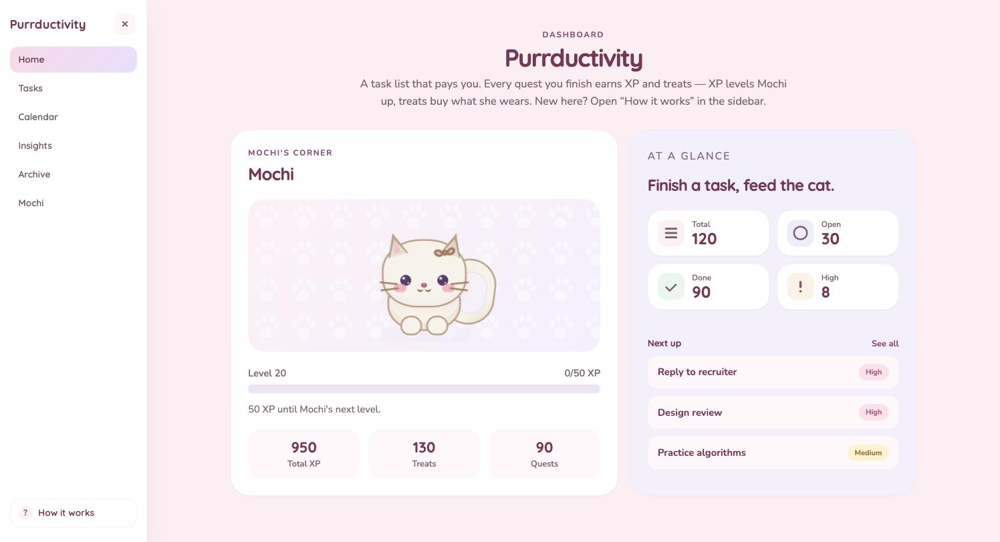
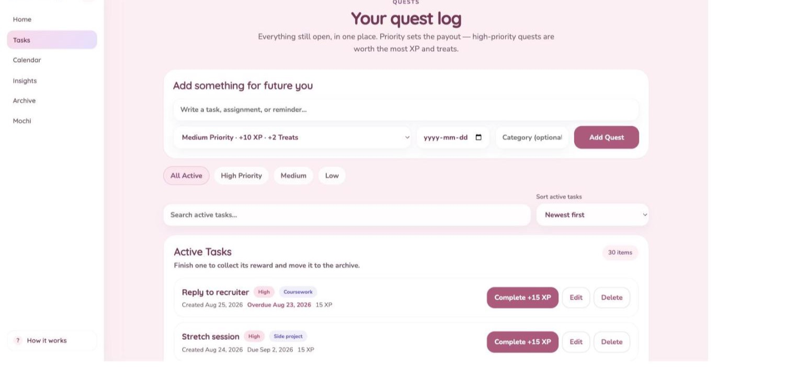
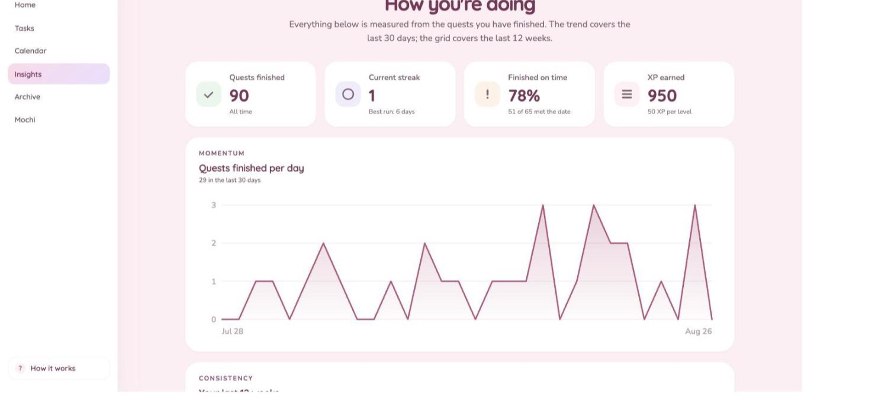
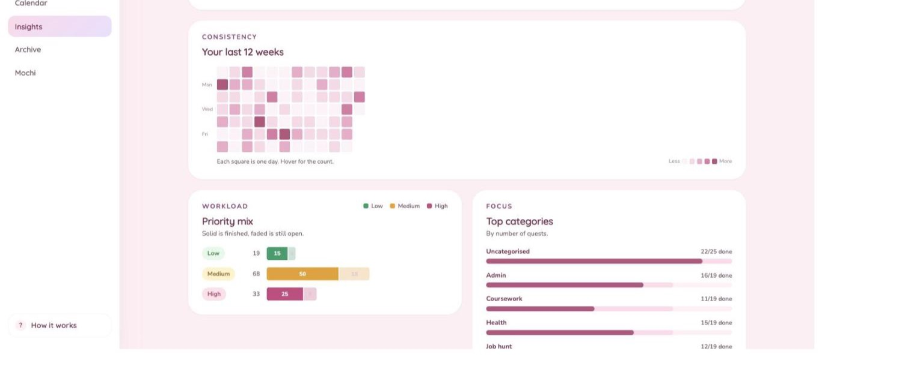
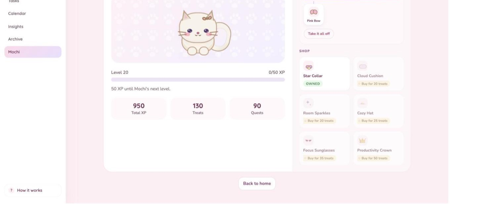
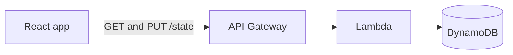

# Purrductivity

A cosy task dashboard where finishing your work feeds a cat.



## Why I made this

I'm a student and I kept bouncing off every to-do app I tried. They worked fine, they just felt like more homework. I wanted something I'd actually want to open, so I built one that looks the way I want my desk to look, and that gives me a reason to come back.

The trick is that tasks pay you. Finish one and you earn XP and treats. XP levels Mochi up, treats buy her outfits. It's a small loop but it's enough to get me to clear the list.

The other reason was AWS. I'd only ever built frontends, so I wanted to find out what it actually takes to put real saved state behind one. Everything here persists to an API Gateway endpoint backed by Lambda and DynamoDB instead of sitting in localStorage. That part taught me the most.

## How the rewards work

| Priority | XP | Treats |
| --- | --- | --- |
| Low | +5 | +1 |
| Medium | +10 | +2 |
| High | +15 | +3 |

Every 50 XP is a level. Levels unlock items in the closet, treats pay for them. A quest only ever pays out once, so you can't farm the same task twice.

## Around the app

**Your quest log.** Add, filter, search, sort. Priority sets the payout, so the task you're avoiding is usually the one worth the most.



**Insights.** Streaks, on-time rate, and a twelve week grid of what you actually finished. Charts are hand built with SVG and CSS, no chart library.





**Mochi's closet.** Where the treats go.



## Built with

React 19, Vite, and React Router on the front. One hand written stylesheet, no Tailwind and no component library. The cat is about forty nested divs shaped in CSS.

Behind it:



One `/state` endpoint that reads and writes a single document, `{ tasks, catProfile }`. It's a single user app, so there's no auth. The backend lives outside this repo.

## Running it

```bash
npm install
cp .env.example .env    # add your VITE_API_URL
npm run dev
```

No backend handy? Run it on generated sample data instead, which skips the network completely:

```bash
VITE_USE_MOCK=true npm run dev
```

That's how the screenshots above were made.

## A few decisions

**Colours live in one place.** The stylesheet started with 61 hardcoded hex values, which made changing anything a find and replace. It now opens with a set of CSS variables.

**Saves are debounced.** Writes wait 600ms and coalesce, so a burst of changes is one request instead of several.

**The stats module is called `stats.js`, not `analytics.js`.** Ad blockers drop any request with "analytics" in the path, and since Vite serves each file separately in dev, that one filename made the whole app render blank while production builds worked fine. Took me a while to find.

## Still to do

No tests yet, though `src/lib` is written as pure functions so they'd be easy to add. Tasks have one free text category rather than proper tags, and dates have no time of day.
