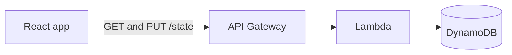

# Purrductivity

A task dashboard where finishing your work feeds a SUPER cute cat!


## Why I made this

I'm a student and none of the to-do apps I tried ever stuck with me. They all worked fine, but I just could never stay consistent in using them. So I built one I'd actually want to look at (super cute), with a cat you feed by getting through your work: finishing a task earns XP and treats, which level Mochi up and buy her things to wear. I also wanted to learn some AWS, so rather than keeping everything in the browser it all saves to API Gateway, Lambda and DynamoDB. That was the part I found hardest and got the most out of.

## How the rewards work

| Priority | XP | Treats |
| --- | --- | --- |
| Low | +5 | +1 |
| Medium | +10 | +2 |
| High | +15 | +3 |

Every 50 XP is a level. Levels unlock items in the closet, treats pay for them. A quest only ever pays out once, so you can't keep farming the same task twice.

## Around the app

**Your quest log.** Add, filter, search, sort. Priority sets the payout, so the task you're avoiding is the one worth the most!


**Insights.** Streaks, on-time rate, and a twelve week grid of what you actually finished. Charts are hand-built with SVG and CSS, no chart library.


**Mochi's closet.** Where the treats go.


## Built with

React 19, Vite, and React Router on the front. One hand written stylesheet, no Tailwind and no component library. The cat is about forty nested divs shaped in CSS.

Behind it:



## Running it

```bash
npm install
cp .env.example .env    # add your VITE_API_URL
npm run dev
```

No backend handy? Run it on generated sample data instead, which skips the network completely:

```bash
VITE_USE_MOCK=true npm run dev
```


